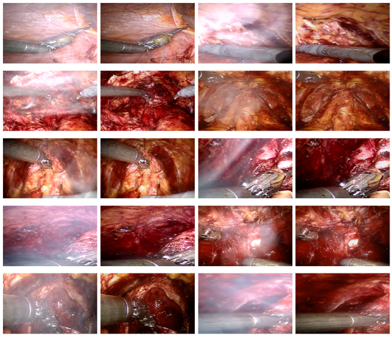

# Benchmark Dataset for Laparoscopic Image Desmoking

*Benchmark dataset to evaluate laparoscopic image desmoking techniques, will be available in October 2024.*

Table of Contents

* [What is this dataset?](#what-is-verse)
* [Citing This Dataset](#citing-verse)
* [Data](#data)
* [To-do list](#Todo)

## What is this dataset?
This is a paired dataset for laparoscopic image de-smoking, which can be used for evaluation, fine-tuning, and image analysis.
 

## Citing this dataset
@inproceedings{xia2024new,
  title={A New Benchmark In Vivo Paired Dataset for Laparoscopic Image De-smoking},
  author={Xia, Wenyao and Fan, Victoria and Peters, Terry and Chen, Elvis CS},
  booktitle={International Conference on Medical Image Computing and Computer-Assisted Intervention},
  pages={3--13},
  year={2024},
  organization={Springer}
}

## Data

* The dataset contains over 900 pairs of smoky and smoke-free surgical images.

## To-do list
- Keep expanding the dataset.
- Provide mask for improved evaluation.
- Fix some of the inaccracies within the dataset.

